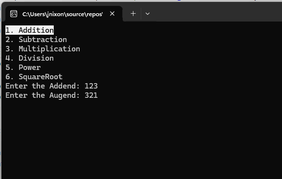

# Assignment 05

Implementing a simple Calculator.



## Universal Acceptance Criteria  

This represents acceptance criteria that is true irrespective of assignment criteria.

(_This does not change from week to week_)

1. You **must understand** every single line of your solution.
2. Your code **must compile and run** without errors.
3. You **must turn in your repository URL** in Brightspace.

## Assignment 

This represents acceptance criteria necessary for assignment completion.

1. All Unit Tests must pass (See `Calculator.cs`.)

   * You can run unit tests at the command line with `dotnet test`.
   * You can run unit tests in VS Code using the Tests tab & click ▶️. 

## Bonus Acceptance Criteria  

This represents optional acceptance criteria available for additional learning and bonus.

1. Implement `Addition` in the Console menu. (See `Program.cs`.)
   * The first number for Addition is the `Addend`.
   * The second number for Addition is the `Augend`.
   * The symbol for Addition is the `+`.

# Setup

> **Existing code** I will be providing to you `Calculator.cs` in `Client.Library`. Your goal is to implement its methods until unit tests pass. I have also provided `Program.cs`. I have also provided the Unit Tests for your `Calculator` class. 

1. **Clone Your Repository**
1. **Configure Debugging**

   - Open Settings (`Ctrl+,`) and search for `csharp.debug.console`.
   - Set its value to `externalTerminal`.

1. **Create Solution Structure**

It's up to you if you use the `dotnet` commands in the terminal of if you create the solution in the VS Code UI. Note that `gitignore` and `editorconfig` files can only be created using the `dotnet` commands in the terminal - there is, currently, no UI equivelent. 

```text
Assignment05.sln
├── .gitignore
├── .editorconfig
├── Client
│   ├── Client.csproj
│   ├── Program.cs 
│   └── References: Client.Library
├── Client.Library
│   ├── Client.Library.csproj
│   └── Calculator.cs (This week, all of your code will be written here.)
└── Client.Library.Tests
    ├── Client.Library.Tests.csproj
│   ├── {many unit test class files}
│   └── References: Client.Library
```

### Now you can do your assignment

 * Read the *Acceptance Criteria*!
 * Keep committing your changes with git.
 * Remember to push your final work!
 * Turn in the URL to your repository.
